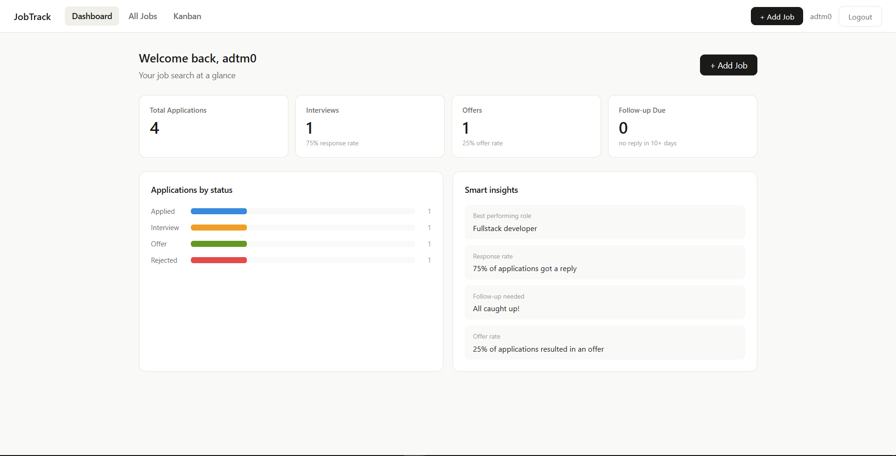
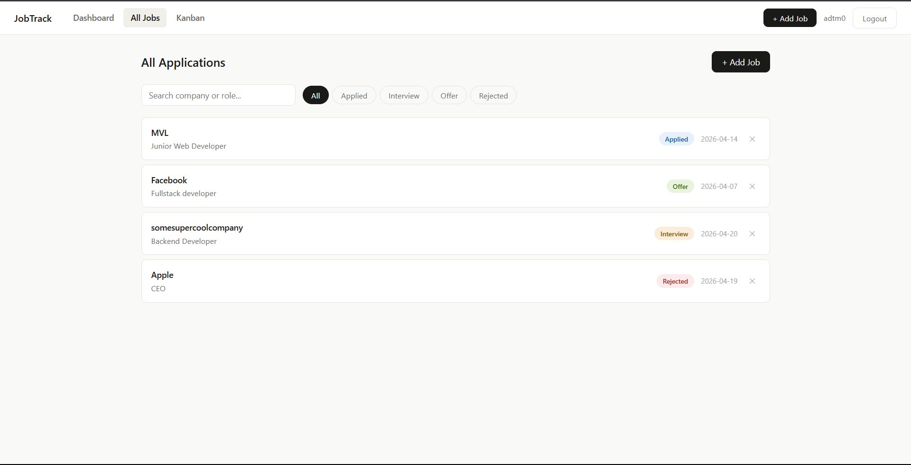
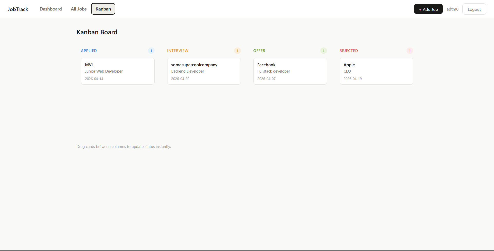

# 📋 JobTrack — Job Application Tracker

**[Live Demo →](https://jobtracker-sage-seven.vercel.app/)**

Job hunting as a student means juggling applications across many platforms. I wanted something better than a spreadsheet — so I built it. This is a full-stack, solo-built app for tracking job applications from start to finish.

---

## Screenshots




## Features

- 🔐 **JWT authentication** — register, login, logout
- 📊 **Dashboard** with real-time stats and application insights
- 🗂️ **Kanban board** with drag-and-drop across status columns
- 🔍 **Search and filter** applications by company, role, or status
- ✏️ Full CRUD — add, edit, and delete applications

## Tech Stack

| Layer | Technologies |
|-------|-------------|
| Frontend | React, Vite, React Router, React Context |
| Backend | Django, Django REST Framework |
| Auth | JWT (JSON Web Tokens) |
| Deployment | Vercel (frontend) + Render (backend) |

## Getting Started

### Frontend
```bash
git clone https://github.com/adtm0/jobtracker.git
cd jobtracker
npm install
npm run dev
```

### Backend
```bash
# (in backend directory)
pip install -r requirements.txt
python manage.py migrate
python manage.py runserver
```

> Make sure to set up your `.env` with the correct API URL and secret keys.

## What I Learned

Built this end-to-end solo. I learned how to connect a React frontend to a Django REST API using JWT authentication, how CORS works between two different servers, and how to manage global auth state with React Context. The biggest challenge was debugging the token refresh flow and getting drag-and-drop working correctly across Kanban columns.

---

Made by [A](https://github.com/adtm0)
